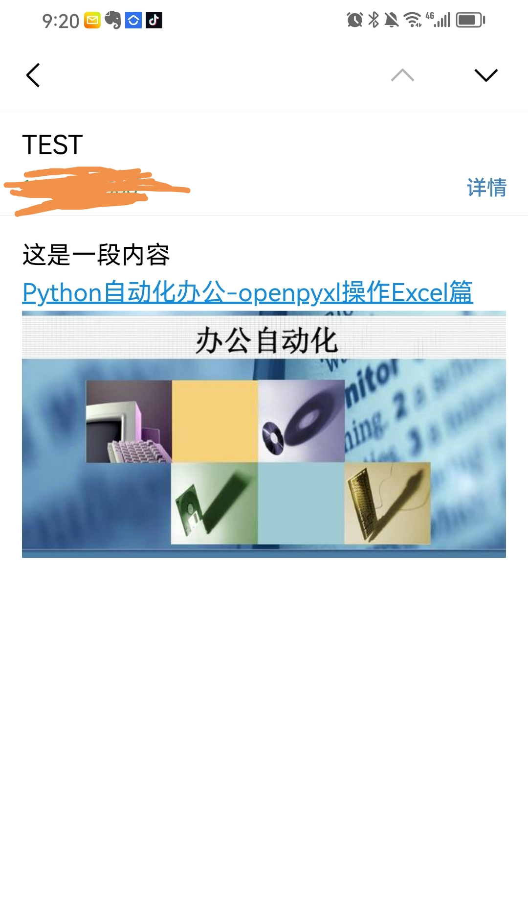

一、需求分析
1、邮件发送
2、定时发送
二、功能实现
1、三方邮件服务器开启
这里以QQ邮箱为例，如果没有开启服务需要开启服务。开启后显示如下：服务已开启。

开启时需要验证，记住密码，在后续代码中使用。

2、编码实现邮件转发
（1）简单邮件发送
```python
import yagmail

yagmail.register('youremail@qq.com', 'mepurcjkqtvidibf')

yag = yagmail.SMTP(user='youremail@qq.com', host='smtp.qq.com')

contents = [
    '这是一段内容'
]
title = 'TEST'
recievers = ['recieveremail@qq.com']
yag.send(to=recievers, subject=title, contents=contents)
```


（2）邮件中使用html
contents中内容可以是html格式。
```python
contents = [
    '这是一段内容',
    '<a href="https://zhuanlan.zhihu.com/p/666231665">Python自动化办公-openpyxl操作Excel篇</a>'
]
```

（3）邮件中发送图片
正文中嵌入图片：
```python
contents = [
    '这是一段内容',
    '<a href="https://zhuanlan.zhihu.com/p/666231665">Python自动化办公-openpyxl操作Excel篇</a>',
    yagmail.inline('autowork.png')
]
```


附件中添加图片（会自动识别为附件，文件本地路径填对即可）：
```python
contents = [
    '这是一段内容',
    '<a href="https://zhuanlan.zhihu.com/p/666231665">Python自动化办公-openpyxl操作Excel篇</a>',
    'autowork.png'
]
```


3、编码实现定时发送
```python
import schedule
import time

def eat_tips():
    print("该吃饭了！")

def meeting_tips():
    print("该开会了！")


schedule.every().day.at("12:00").do(eat_tips)
schedule.every().day.at("18:00").do(eat_tips)
schedule.every().monday.at("19:00").do(meeting_tips)


while True:
    schedule.run_pending()
    time.sleep(1)
```


