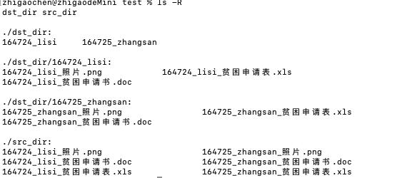
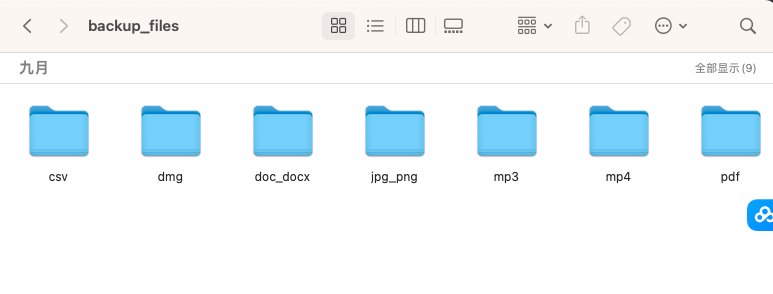

# 第1章 文件操作篇
本章主要分为4节，前2节对文件、目录的常见操作进行介绍，3节对压缩文件的操作进行了介绍，第4节选择两个示例来将我们所学进行应用。我们可以结合本章所学，应用在工作中其他场景。
## 一、文件操作
### 1、文件创建
### （1）open函数
Python内置了一个名为open的函数，它可以用于创建、打开和修改文件。
```python
file = open("new_file.txt", "w")
file.close()
```
使用"new_file.txt"作为文件名，并使用"w"作为访问模式。其中，"w"代表写入模式，它会创建一个新文件，并允许写入内容。
### （2）with关键字
在使用open函数创建文件时，我们需要手动关闭文件，以确保资源得到释放。为了简化这个过程，Python提供了一个更好的方式，即使用with关键字。示例如下：
```python
with open("new_file.txt", "w") as file:
    # 在这里进行文件操作
    pass
```

### 2、文件删除
os模块适用于删除单个文件或空目录；
shutil模块适用于删除单个文件或非空目录；
使用外部命令删除文件(os.system(),subprocess.call())则需要慎重考虑命令的风险和安全性。

### （1）os.remove()
os模块中的`remove()`方法可以直接将指定的文件删除。代码示例如下：

```python    
import os

try:
    os.remove('test.txt')
    print('文件删除成功')
except Exception as e:
    print('文件删除失败', e)
    
```
需要提醒的是，如果文件不存在，将会抛出文件不存在的异常。注意只能删文件，如果给了一个文件夹路径则会报错。
### （2）shutil模块删除文件
shutil模块是Python标准库中的一个文件操作工具模块，其提供了更为丰富的文件操作功能，其中删除文件的函数是os.unlink()。
```python
import shutil

try:
    shutil.unlink('file.txt')
    print("文件删除成功！")
except Exception as e:
    print("文件删除失败：", e)
```
shutil模块的os.unlink()函数与os模块的os.remove()函数本质上是相同的，都可以用于删除文件。
此外，shutil模块还提供了rmtree()函数用于删除指定路径下的所有文件及其子目录。

```python   
import shutil

try:
    shutil.rmtree('./test_dir')
    print("目录删除成功！")
except Exception as e:
    print("目录删除失败：", e)
    
```

上述代码将删除指定路径下的test_dir目录及其所有子目录和文件。
### （3）使用os.unlink()方法删除文件
```python
import os

try:
    os.unlink('test.txt')
    print('文件删除成功')
except Exception as e:
    print('文件删除失败', e)
```
os.unlink()方法跟os.remove()方法一样，只能删除文件，不能删除目录。
### （4）使用os.system()方法删除文件
os模块还提供了与操作系统交互的方法system()。我们可以使用这个方法来执行运行时脚本命令，并删除文件。示例如下：
```python
import os

try:
    os.system('rm test.txt')
    print('文件删除成功')
except Exception as e:
    print('文件删除失败', e)
```   

需要注意的是，os.system()方法依赖于操作系统，所以可移植性相对较差。除非使用的是类Unix系统，否则请谨慎使用。
### （5）使用subprocess.call()删除文件
```python
import subprocess

cmd = "rm -rf ./test_dir"
try:
    subprocess.call(cmd, shell=True)
    print("命令执行成功！")
except Exception as e:
    print("命令执行失败：", e)
    
```
上述代码中，通过subprocess.call()函数执行了shell命令rm删除了指定目录下的test_dir目录及其所有文件。

需要注意的是，使用外部命令删除文件时，需要确保命令的正确性和安全性。

### 3、文件读取
### （1）open()方法读取
```python

file = open('file.txt', 'r')
# 在此处进行文件读取操作
file.close()

```
### （2）with语句读取
```python

with open('file.txt', 'r') as file:

content = file.read()

print(content)

```
### （3）异常处理
```python

try:

    with open('file.txt', 'r') as file:

        content = file.read()

        print(content)

except FileNotFoundError:

    print('文件不存在')

```
也可以在读取文件前判断文件是否存在：
```python
import os
file_path = "new_file.txt"
if not os.path.exists(file_path):
    open(file_path, "w").close()
    print(f"文件 {file_path} 创建成功")
else:
    print(f"文件 {file_path} 已存在")
```
Python提供了多种读取文件的方法，包括read()、readlines()和readline()三种方法。

### （4）read()方法

read()方法用于读取整个文件的内容，并将其存储为一个字符串。例如，要读取名为'file.txt'的文件的所有内容，可以使用以下代码：

```python

file = open('file.txt', 'r')

content = file.read()

print(content)

```

### （5）readlines()方法

readlines()方法用于读取整个文件的内容，并将其存储为一个列表，列表中的每个元素表示文件中的一行。例如，要读取名为'file.txt'的文件的所有内容，可以使用以下代码：

```python

file = open('file.txt', 'r')

lines = file.readlines()

for line in lines:

print(line)

```

### （6） readline()方法

readline()方法用于读取文件的一行内容，并将其存储为一个字符串。每次调用readline()方法会读取文件中的下一行内容。例如，要读取名为'file.txt'的文件的第一行内容，可以使用以下代码：

```python

file = open('file.txt', 'r')

line = file.readline()

print(line)

```
### 4、文件写入
### （1） 写入文件时的不同模式

- 覆盖模式（“w”）：打开文件并将内容写入文件，如果文件存在，则覆盖原有内容。如果文件不存在则创建一个新的文件。
- 追加模式（“a”）：打开文件并将内容写入文件，如果文件存在，则在文件末尾添加内容。如果文件不存在则创建一个新的文件。
- 读写模式（“r+”）：打开文件供读取和写入，如果文件存在，则覆盖原有内容。如果文件不存在，将抛出`FileNotFoundError`异常。

### （2）写入字符串数据
```python
# 写入字符串数据
with open("file.txt", "w") as file:
    file.write("Hello, World!\n")
    file.write("This is a new line.")
```
### （3）写入字节数据
- 使用`write()`方法将字节数据写入文件。
- 可以使用`encode()`方法将字符串转换为字节数据进行写入。

```python    
# 写入字节数据
with open("file.txt", "wb") as file:
    content = "Hello, World!\n"
    file.write(content.encode("utf-8"))
```
### （4）writelines()
写入list内容，不会在元素之间自动添加换行符。

### 5、文件移动
`shutil.move(要移动的文件/文件夹,要移动的位置)`
```python
import shutil
    
shutil.move('file1.txt','new_folder/file2.txt')
```
两种方式使用： 
- 第二个参数是文件夹位置，则移动到文件夹下面 
- 第二个参数是文件路径，移动到这个路径并且重命名
注意：如果是文件夹后面一定要加`'/'`。
### 6、文件拷贝
### （1）shutil.copy
`shutil.copy(要复制的文件，要复制到的位置)`

```python    
import shutil
    
shutil.copy('file1.txt','./new_folder')
shutil.copy('file1.txt','./new_folder/new_file.txt')
```
两种实现方案： - 第二个参数写某个文件夹位置，则复制到该文件夹下 - 第二个参数写文件路径，复制到这个路径并且重命名。
### （2）shutil.copyfile
`copyfile(source_file, destination_file)`
只有当目标是可写的，这个方法才会将源内容复制到目标位置。如果你没有写入权限，则会导致 IOError 异常。

### （3）shutil.copy2
copy2() 方法的功能类似于 copy()。但是它可以在复制数据时获取元数据中添加的访问和修改时间。复制相同的文件会导致 SameFileError 异常。

### （4）copy() vs copyfile()

copy() 还可以在复制内容时设置权限位，而 copyfile() 只复制数据。

如果目标是目录，则 copy() 将复制文件，而 copyfile() 会失败，出现 Error 13。

有趣的是，copyfile() 方法在实现过程中使用 copyfileobj() 方法，而 copy() 方法则是依次使用 copyfile()和copymode() 函数。copyfile() 会比 copy() 快一点。
### （5）copy() vs copy2() 
copy() 只能设置权限位，而 copy2() 还可以使用时间戳来更新文件元数据。

copy() 在函数内部调用 copyfile() 和 copymode(), 而 copy2() 是调用 copystat() 来替换copymode()。

### 7、文件读写模式
|  打开模式  |  文件类型  |  方式  |  对已有文件影响  |  如果文件不存在  |  备注  |
| ---- | ---- | ---- | ---- | ---- | ---- |
|  r  |  文本  |  只读  |  无  |  抛异常  |  write等方法不可用  |
|  rb  |  二进制  |  只读  |  无  |  抛异常  |  write等方法不可用  |
|  r+  |  文本  |  读写  |  追加  |  抛异常  |  无  |
|  rb+  |  二进制  |  读写  |  追加  |  抛异常  |  无  |
|  w  |  文本  |  只写  |  覆盖并新建  |  新建  |  read等方法不可用  |
|  wb  |  二进制  |  只写  |  覆盖并新建  |  新建  |  read等方法不可用  |
|  w+  |  文本  |  读写  |  覆盖并新建  |  新建  |  因为覆盖原来文件，read等方法获取到原文件的内容  |
|  wb+  |  二进制  |  读写  |  覆盖并新建  |  新建  |  因为覆盖原来文件，read等方法获取到原文件的内容  |
|  a  |  文本  |  追加  |  追加到最后  |  新建  |  read等方法不可用  |
|  ab  |  二进制  |  追加  |  追加到最后  |  新建  |  read等方法不可用  |
|  a+  |  文本  |  读写  |  追加到最后  |  新建  |  无  |
|  ab+  |  二进制  |  读写  |  追加到最后  |  新建  |  无  |

### 8、文件信息获取
```python
import os
    
for file in os.scandir():
    print(file.stat())
```
`os.scandir()`返回的文件都可以查询信息 - st_size: 文件的体积大小（单位：bytes），除以10024就是KB -
st_atime: 文件的最近访问时间 - st_mtime：文件的最近修改时间 - st_ctime：Windows下表示创建时间 -
st_birthtime:只在Mac、Linux下可用，表示创建时间

### 9、文件名称匹配
### （1）字符串内置方法

`.startswith()`,`.endswith()`

### （2）glob模块
```python
import glob
    
print(glob.glob('*.py'))
    
print(glob.glob('**/*.txt',recursive=True))
```
模式| 意义  
---|---  
＊| 匹配所有  
?| 匹配任何单个字符  
[seq]| 匹配seq中的任何字符  
[!seq]| 匹配任何不在seq中的字符  
  
> 用`**`表示任意层文件或文件夹 recursive＝True会不断进入文件夹内

### （3）匹配文件名
```python
import fnmatch
    
print(fnmatch.fnmatch('lesson1.py', 'le*1.py'))  # True
print(fnmatch.fnmatch('lesson1.py','le*[0-9].py')) # True
```
### 10、临时文件创建

`TemporaryFile()`
```python
from tempfile import TemporaryFile
f = TemporaryFile('w+')
f.write('Hello World')
f.seek(0)
data = f.readlines()
print(data)
f.close()
    
with TempooraryFile('w+') as f:
    f.write('Hello World')
    f.seek(0)
    data = f.readlines()
    print(data)
```
'w+'表示写入及读取文件 .seek(0)表示回到文件开头位置 程序运行完后会自动删掉临时文件
### 11、文件重命名

`os.rename(要重命名的文件/文件夹,新的文件/文件夹)`
```python
import os
    
os.rename('old_file.txt','new_file.txt')
```

## 二、目录操作

### 1、获取程序运行路径
```python
import os

os.getcwd()
```
### 2、路径拼接

> Windows中采用反斜杠()作为作为文件夹之间的分隔符； Mac和Linux中采用正斜杠(/)作为文件夹之间的分割符。

为了解决跨平台的不一致，使用os模块下的系统函数进行拼接：
```python
os.path.join('MyApp', 'service')
```

> `MyApp\\service` `MyApp/service`

### 3、列出当前文件夹下所有的文件和文件夹
```python
os.listdir()
os.listdir(指定目录)
    
for file in os.scandir():
    print(file.name, file.is_dir())
```
判断文件还是文件夹：
```python
os.path.isdir(file)
os.path.isfile(file)
```

### 4、遍历目录下所有的文件
```python
for dirpath, dirnames, files in os.walk('./'):
    print(f'发现文件夹：{dirpath}')
    print(files)
```

> dirpath 是文件夹路径； dirnames是dirpath这个文件夹下的子文件夹列表； files是dirpath这个文件夹里的文件列表。

### 5、创建临时文件夹

```python
from tempfile import TemporaryDirectory
    
with TemporaryDirectory() as tmp_folder:
    print(f'tmp_folder:{tmp_folder}')
```
程序结束后会自动删掉该文件夹。


### 6、创建单层文件夹
```python
import os
os.mkdir('新文件夹')
```
放文件夹已经存在时运行这句代码会报错，`FileExisitsError`。
```python
if not os.path.exists('新文件夹'):
    os.mkdir('新文件夹')
```
只有当文件夹不存在的时候创建文件夹。

### 7、创建多层文件夹

`os.makedirs(新文件夹名称)`
```python
os.makedirs('第一层文件夹/第二层文件夹/第三层文件夹')
```
当最里层文件夹已经存在时（第三层）运行这句代码会报错。


### 8、复制文件夹

`shutil.copytree(要复制的文件夹,要复制到的新文件夹位置）`

```python
import shutil
    
shutil.copytree('文件夹1','文件夹2')
```
会将文件夹内的所欲文件和文件夹都复制过去，新的文件夹不能已经存在。

### 9、移动文件夹

`shutil.move(要移动的文件/文件夹,要移动的位置)`
```python
import shutil
    
shutil.move('folder_1','new_folder/')
```
两种方式使用： 
- 第二个参数是文件夹位置，则移动到文件夹下面 
- 第二个参数是文件路径，移动到这个路径并且重命名
注意：如果是文件夹后面一定要加`'/'`。

### 10、重命名文件夹

`os.rename(要重命名的文件/文件夹,新的文件/文件夹)`
```python
import os
    
os.rename('old_folder','new_folder')
```

### 11、删除文件夹

`shutil.rmtree(要删除的文件夹)`

```python
import shutil
    
shutil.rmtree('文件夹')
```
## 三、压缩文件操作

### 1、读取压缩包文件

`zipfile.ZipFile(),.namelist()`
```python
import zipfile
    
with zipfile.ZipFile('压缩包.zip'，'r') as zipobj:
    print(zipobj.namelist())
```
乱码情况处理：
```pyhon
for file_name in zipodj.namelist():
    print(file_name.encode('cp437').decode('gbk'))
```
### 2、获取压缩包文件信息
```python
info = zipobj.getinfo(file_name)
print(info.file_size,info.compress_size)
```
`file_size`是原始文件的大小 `compress_size`是压缩后大小，输出单位为字节。

### 3、解压压缩包

`zipobj.extract(压缩包要解压的文件名，解压到的位置)`

```python
with zipfile.ZipFile('压缩包.zip','r') as zipobj:
    zipobj.extract('file1.txt')
```
中文名字解压后会出现乱码 乱码解决：

```python    
for file_name in zipobj.namelist():
    correct_path = file_name.encode('cp437').decode('gbk')
```
建议路径中文件和文件夹不要出现中文。 如果有中文可以现货区正确的编码文字，再重命名。

### 4、将所有的文件都提取出来

`.extractall(解压到的位置)`
```python
with zipfile.Zipfile('压缩包.zip','r') as zipobj:
    zipobj.extractall()
```
默认当前路径。 带密码的压缩文件解压：
```python
zipobj.extractall(path='',pwd=b'')
```
### 5、创建压缩包

`zipobj.write(待压缩文件名)`
```python
import zipfile
    
file_list = ['1.txt','2.txt','3.txt']
    
with zipfile.ZipFile('压缩包.zip','w') as zipobj:
    for file in file_list:
        zipobj.write(file)
```
mode='a' 表示追加。

## 四、经典案例
### 案例1：学生信息收集
班长要收集班级的贫困申请信息：需要准备照片、贫困申请书、贫困申请表三个文件。 此时班长想要为每个学生建立一个文件夹，将三个文件放到对应的文件夹中，文件夹按照`学号_学生姓名`形式进行命名。
详细代码请见`StudentInfoCollect.py`。

### 案例2：定期备份文件
我们日常下载文件都会放到C盘，时间久了，C盘就会撑爆，因此需要我们定期对文件进行备份，放到一个不占C盘的空间。
详细代码请见`BackupFile.py`。

